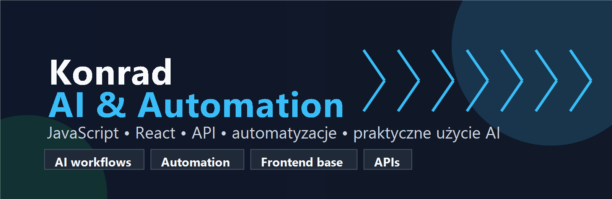

  

<h1 align="center">Konrad | AI & Automation</h1>

  <a href="https://chomikejsi.github.io/Chomikejsi/"><strong>Portfolio live</strong></a>

  Rozwijam się w kierunku AI, automatyzacji i narzędzi, które realnie usprawniają codzienną pracę.
  Buduję fundamenty w JavaScript, React i API, żeby tworzyć praktyczne aplikacje, integracje oraz automatyzacje.

  
  
  
  

---

## Nad czym pracuję

- rozwijam projekty webowe i poprawiam je tak, żeby były czytelne, responsywne i gotowe do portfolio,
- buduję **LegitLens** — rozszerzenie Chrome/Edge do analizy zaufania stron, phishingu, scamów i podejrzanych formularzy,
- uczę się pisać automatyzacje, które oszczędzają czas i ograniczają ręczną pracę,
- interesuję się praktycznym wykorzystaniem AI w analizie, kodowaniu i procesach biznesowych,
- buduję fundamenty pod narzędzia łączące frontend, API, automatyzacje i modele AI,
- porządkuję GitHuba tak, żeby pokazywał mój kierunek: technologia, produktywność, automatyzacja i AI.

## Wybrane projekty

| Projekt | Opis | Link |
| --- | --- | --- |
| LegitLens | Polski skaner zaufania stron: kontekst, domeny, formularze, linki, BLIK, kurierzy i ochrona przed fałszywymi alarmami. | [Repozytorium](https://github.com/Chomikejsi/legitlens-extension) |
| Jeźdźcy Szopokalipsy | Projekt grupowy z responsywnym layoutem, Sass i Parcel. | [Live](https://wiecek-k.github.io/Jezdzcy-Szopokalipsy/) |
| WebStudio | Responsywna strona agencji z animacjami, modalem i dopracowanym układem. | [Portfolio live](https://chomikejsi.github.io/Chomikejsi/) |

## Technologie

| Obszar | Technologie |
| --- | --- |
| Frontend | HTML, CSS, Sass, JavaScript, React |
| Automatyzacja | API, workflow, integracje, narzędzia produktywności |
| AI | modele językowe, automatyzacja zadań, analiza tekstu, agentowe workflow |
| Narzędzia | Git, GitHub, VS Code |

## Co chcę pokazywać w projektach

- responsywne strony i aplikacje,
- czysty, czytelny kod,
- dobre README i opis celu projektu,
- poprawianie starszych repozytoriów pod portfolio,
- myślenie procesowe: jak uprościć zadanie, zautomatyzować krok albo przygotować kod pod integrację.

## Kierunek rozwoju

Moim celem jest specjalizacja w **AI & Automation**: chcę tworzyć narzędzia, które pomagają szybciej wykonywać powtarzalne zadania, analizować informacje i usprawniać codzienną pracę.

Najbardziej interesują mnie:

- automatyzacja powtarzalnych zadań,
- integracje z API,
- AI jako wsparcie pracy, nauki i analizy,
- proste narzędzia wewnętrzne,
- agentowe workflow i aplikacje wspierające decyzje.

## Dla rekrutera

Jeśli przeglądasz mój profil rekrutacyjnie, najlepiej zacząć od projektów webowych i portfolio live. Pokazują moje podstawy techniczne, a kolejne projekty będą coraz mocniej skręcały w stronę AI, automatyzacji i praktycznych narzędzi.

---

  Profil jest w trakcie rozwoju, ale traktuję go jak portfolio: ma pokazywać regularną naukę, poprawianie kodu i świadome budowanie warsztatu pod specjalizację AI & Automation.

